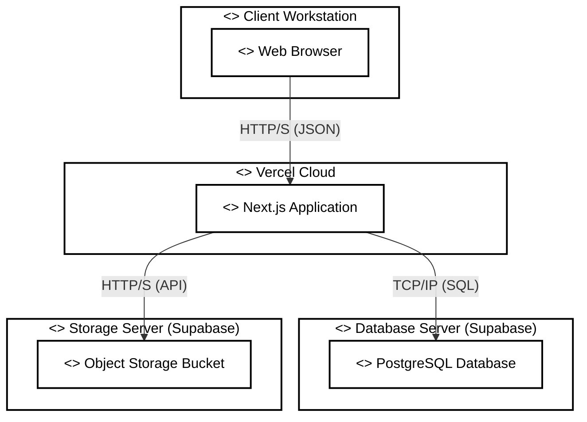

# Deployment Diagram (UML Standard)

Berikut adalah diagram dengan **High Contrast Mode** (hitam di atas putih) untuk memastikan keterbacaan maksimal.

## Keterangan
*   Diagram ini menggunakan latar `fill:#ffffff` (Putih) dan teks `#000000` (Hitam) secara eksplisit.
*   Garis tepi dibuat tebal (`stroke-width:2px`) agar batas kotak terlihat tegas.
